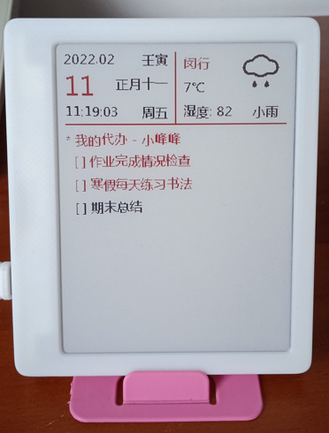
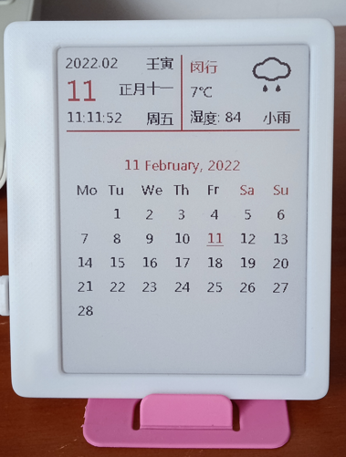
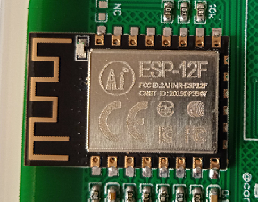
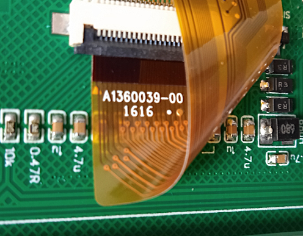
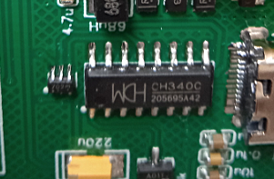
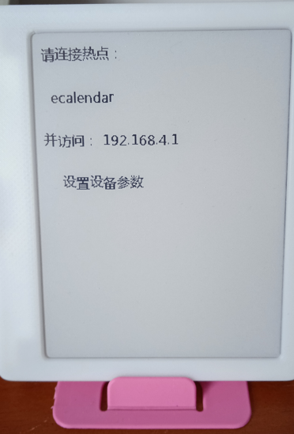
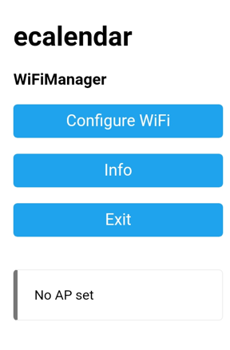
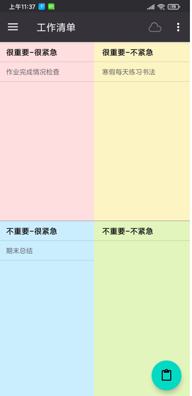
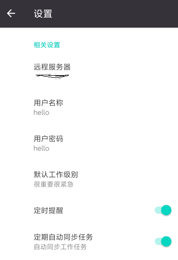

# 电子墨水屏待办清单
电子墨水屏的待办事项显示日历，折腾了一段时间，终于有了些进展。

- 白天显示待办事项

- 月历显示

## 缘由
一直用 TODOLIST 类的软件，记录个人待办的事项。手机上用的是 高效todo 和 微软的 todo 软件。高效todo的app用了好几年了，并且四象限的优先级分类方式，用起来比较顺手。也入手了kindle，相比平板、手机的待机时间要长很多。那时候就想弄个电子台历。当时的想法是，手机端输入的待办清单，可以自动同步到显示电子墨水屏，类似台历放在桌面上。

## 硬件
想法有了后，一直在找合适的硬件。15、16年左右，有各种类树莓派的开发板出现。象pcduino，香蕉派，硬件性能足够。可以刷 openwrt，linux等做路由和mini服务器。也入手过 51 单片机和 stm32， 因为尺寸问题，不是很适合。
也关注过某宝上的电子墨水屏店家，主要是微雪和大连佳显，但是 屏幕和驱动板的单价都不是很便宜，屏幕和驱动板价格加起来二三百，不划算，就一直拖着。
去年逛咸鱼，有各种二手电子标签卖，然后看到了有改装的天气日历买。带wifi和蓝牙的129，价格可以接受，并且已经有电池 + 3d打印外壳，不用摸电烙铁，果断入手最便宜的， 99包邮到家，开始折腾。

## 硬件清单
货几天后收到了，为表诚意，先确认收货，然后问卖家有啥技术资料否，没理我。没办法，只好”拆“。

**主控芯片**

 

* 主控芯片，esp12-F，网上查到的 flash大小 4M。

**屏幕**

* 上面是屏幕排线的编号，买的是三色黑白红的屏幕。猜测是微雪 4.2 三色屏幕。

**USB串口**

* 串口芯片是 CH340C，

板子上主要的硬件就是这几个，还有就是咸鱼上介绍是基于立创的[墨水屏日历](https://oshwhub.com/duck/4-2-cun-mo-shui-ping-ri-li)，有PCB 和 bom 表等信息，可以参考这个确认 SPI 管脚号。

## 参考项目
代码参考了是网上的[毒鸡汤日历](https://github.com/breakstring/eInkCalendarOfToxicSoul)项目，借用了天气部分代码,及天气图标绘制。

## 软件开发

* **开发环境** 硬件到位，然后搞开发环境。CH340 是南京沁恒生产的，可以在他们网站上下到usb串口驱动。Arduino IDE太简单，参照参考项目，使用vscode ＋ platformio插件开发。

* **Framework及第三方库** 使用esp8266平台，arduino framework框架。其他用到的库
    - [Adafruit GFX](https://github.com/adafruit/Adafruit-GFX-Library)
    - [GxEPD2](https://github.com/ZinggJM/GxEPD2):基于[Adafruit_GFX](https://github.com/adafruit/Adafruit-GFX-Library)电子墨水屏驱动库。
    - [U8g2 for Adafruit GFX](https://github.com/olikraus/U8g2_for_Adafruit_GFX)：一套基于[U8g2](https://github.com/olikraus/U8g2)字体引擎来通过Adafruit GFX来显示文字的第三方库。
    - [ArduinoJSON](https://arduinojson.org/):JSON字符串处理。
    - [ESPDateTime](https://github.com/mcxiaoke/ESPDateTime):网络时间库
* **字体** 软件中使用的字体是文泉驿等宽微米黑。

* **软件组成**
    - 后台数据接口部分使用 php + mysql 实现，实现待办事项数据存取接口
    - 待办事项输入部分，实现了个简单的app，实现新增待办，待办完成等
    - PC端桌面版已经补充实现，详细见[PC桌面版.md](./PC桌面版.md)
    - esp8266 获取待办列表及展示，并显示些天气信息

* **其他工作** 
    - 需要申请和风天气接口 key

## 软件功能
* 手机端app输入待办事项，日历定时刷新显示未完成事项。
* 农历、天气情况显示
* 白天显示待办，晚上9点后，显示月历。

## 软件部署及使用

* **服务器端设置**
    - 创建数据库，使用 doc 目录下， Todolist.sql 导入， 创建待办数据库，并设置数据库帐号、权限。

    - 部署 web_backend 目录下 php 文件到 apache服务目录，修改 config.php 设置数据库访问帐号，密码。将和风天气key，更新到weather.php。需设置 对外目录为 http://xxx.xxx.xxx.xxx/todotask/xx.php

    - 设置待办事项用户，帐号密码及设备号，目前未实现设置界面，可以直接在数据库中填写。用户、密码、昵称等用于app访问，设备号用于 ESP8266 访问待办事项。 设备通过设备号与帐号绑定，如果一个用户有多个设备可以通过","分割输入。

* **设备端设置**: 设备通过wifi访问网络获取工作列表，初始显示配置信息，用手机端连接配置热点并完成配置。
    - **设备设置**：设备需要将 data 目录下的文件，通过 platformio 创建 flash 文件系统并导入。设备初次启动，会启动 wifi manager ，用于配置 wifi 网络。通过手机连接后，设置网络参数及待办清单数据接口地址。
    
    
     
    
     
    

    - 通过界面设置服务器地址，设备编号，城市及区域编号（具体请参考和风天气接口）

* **APP设置**
    - 简单的安卓app，安装包 doc 目录下 ecalendar.apk。
    
    
     
    

    - app代码写的太差，好多功能未实现，不开源了。需要修改，可以通过网页方式实现事项输入。同时，微软的 todo 也开放数据接口，可以修改下后端的接口实现，就可以直接接入微软 todo app了。 

## 开发中的问题
* **u8g2**: 字体库问题，u8g2在esp8266上,应为8266运行内存国小，存在问题，直接使用生成的字体文件，导致运行时会出错,反复重启，需要修改， 编译时，使用 doc目录下 u8g2_for_adafruit_gfx 中代码，替换下载的库代码（参考自[甘草酸不酸](https://gitee.com/Lichengjiez/weather-ink-screen)天气日历项目）。

* **和风天气**: 接口使用 https 协议访问，目前代码中使用的esp8266 sdk版本的 ssl 实现有问题，连接和风接口时，总是报错。所以天气接口改为在后端php实现，通过后端调用天气接口。

* **GxEPD** 显示的字体比较难看，存在高低和错位等问题，尝试过其他的 微软雅黑、汉仪等，都不理想。

